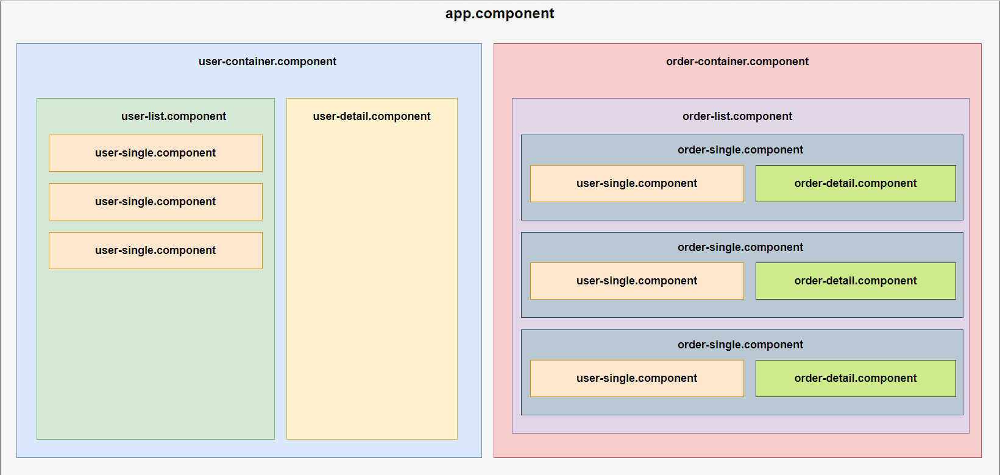

# Esercizi Angular

Nei vari branch si trovano gli 8 esercizi, che prevedono l'implementazione di comunicazione tra componenti (property binding e event bindig) e semplici oprazioni CRUD su un array di dati.

Replicare la seguente struttura su angular

Extra: Replicare anche il layout oltre la struttura

